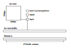

# The Simplest Virtual Computer (16 bit)
<div align="center">

  </div>
This is the spec for an extremely simple "virtual computer" that can be emulated on a modern computer.

The goal in one word is **simplicity**. It should be simple to understand every instruction, to write machine code that runs on it, and to write a compiler for it.

## Quick Overview
### No Registers
There are no CPU registers, just one chunk of memory. Values can be loaded from every memory address and written to every memory address.

### Everything is an unsigned 16-bit integer
Everything is represented as a (le) unsigned 16-bit integer. That includes numbers, addresses, colors, the instruction-pointer and the input. 
Booleans are represented as u16 values as well: 0 for false and >0 for true. (1 when written as a boolean.)

### Wrapping Arithmetic
All numerical operations that will appear in the instructions are wrapping operations. Division by zero crashes the program.

### No Magic Numbers
The main memory contains one valid address for every u16.
The screen-buffer is the same size as the memory and there is one pixel for every u16.

### No Fluff
There are as few features as possible.
That means limited input, no sound, no variable display size etc. 
It also means that there are no accelerators or trick to help with performance.

### Setup
Here is a sketch of all components of the virtual computer:



### Instruction-pointer

This value is an address in the main memory. It starts as zero. Then, it is manipulated by the instructions. All operations are wrapping.

### Screen

The screen has a resolution of $256*256=2^{16}$ pixels. The color of each pixel is represented with 16-bits using `RGB565`. The coordinate $(x,y)$ of the screen maps to the index $256y+x$ in the screen-buffer. The coordinate $(0,0)$ is in the upper left-hand corner. Changes to the screen-buffer are not reflected on the screen until the system is synchronized.

### Input

The only supported inputs are the mouse position and the left and right mouse keys.

On synchronization the input on the last frame is loaded into the input-buffer.

The "Position code" is the index of the pixel, the mouse is currently on. 
The "Key code" is given by left_mouse+2*right_mouse. So it can have the values 0 1 2 or 3.

The instructions are in general one frame behind.

### Synchronization

When the console executes the sync instruction, the screen-buffer is drawn to the screen. It is not cleared. The input-buffer and the frame-count are updated. The system will be put to sleep until the beginning of the next frame. The targeted timing is 30fps. There is a hard limit of 3000000 instructions per frame. This means that if the `sync` command has not be called for 3000000 instructions, it will be performed automatically.

## CPU

All instructions are 4 values long. A value is, of course, a u16. 

The instructions have the form `opcode arg1 arg2 arg3`. 

In the following table, all instructions are listed. `@arg1` refers to the value at the memory address `arg1`. If the opcode is greater than 15, it is treated as being zero. If one of the three arguments is not used, it can be set to any value, but it can not be omitted.

When the instruction-pointer advances, it does so by four positions.

| Opcode | Name      | Advances   | Effect                                                                       |
| ------ | --------- | ---------- | ---------------------------------------------------------------------------- |
| 0      | **Set**   | yes        | `@arg1=arg2`                                                                 |
| 1      | **GoTo**  | if skipped | `if(not @arg3){inst_ptr=@arg1+arg2}`                                         |
| 2      | **Skip**  | if skipped | `if(not @arg3){inst_ptr=inst_ptr+4*arg1-4*arg2}`                             |
| 3      | **Add**   | yes        | `@arg3=(@arg1+@arg2)`                                                        |
| 4      | **Sub**   | yes        | `@arg3=(@arg1-@arg2)`                                                        |
| 5      | **Mul**   | yes        | `@arg3=(@arg1*@arg2)`                                                        |
| 6      | **Div**   | yes        | `@arg3=(@arg1/@arg2)`                                                        |
| 7      | **Cmp**   | yes        | `@arg3=(@arg1<@arg2)` as unsigned                                            |
| 8      | **Deref** | yes        | `@arg2=@(@arg1+arg3)`                                                        |
| 9      | **Ref**   | yes        | `@(@arg1+arg3)=@arg2`                                                        |
| 10     | **Inst**  | yes        | `@arg1=inst_ptr`                                                             |
| 11     | **Print** | yes        | Writes `color=@arg1` to `index=@arg2` of screen-buffer.                      |
| 12     | **Read**  | yes        | Copies `index=@arg1` of screen-buffer to `@arg2`                             |
| 13     | **Band**  | yes        | `@arg3=@arg1&@arg2`                                                          |
| 14     | **Xor**   | yes        | `@arg3=@arg1^@arg2`                                                          |
| 15     | **Sync**  | yes        | Puts `@arg1=position_code`,  `@arg2=key_code` and synchronizes in that order |

## Constructing a Program

A program is really just the state of the main memory. There is no distinction between memory that contains instructions and memory that contains some other asset. The initial state is loaded from a binary file that is read as containing the (le) u16 values in order. The maximum size is $2*2^{16}=$ bytes ($\approx$ 131.1kB). 
It can be shorter, in which case the end is padded with zeroes.

## Example

A simple example would be to print all $2^{16}$ possible colors to the screen. 
We make our lives easier, by mapping each index of the screen-buffer to the color which is encoded with the index. 
Here, we use the names of the opcodes instead of their numbers.

```
Set 501 1 0       // Set the number one to 501
Set 502 65535 0   // Set the number one to 501
Print 500 500 0   // Print the color at 500 to the index at 500
Add 500 501 500   // Increment the color value
Cmp 500 502 503   // See if we are not at the max number
Xor 503 501 503   // Negate it
Skip 0 4 503      // unless we are at the max number, go back 
Sync 0 0 0        // Sync 
GoTo 0 0 0        // Repeat to keep the window open
```

We get the following output:


